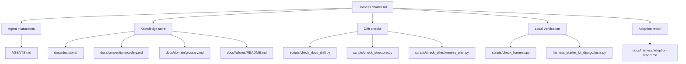

# harness_starter_kit_django

`harness_starter_kit_django`는 Harness Starter Kit을 적용해 만든 작은
Django 게시판 프로젝트입니다. 현재 기능은 공개 게시판 CRUD이며, Django의
모델, 폼, 클래스 기반 뷰, 템플릿, 테스트, 마이그레이션을 사용합니다.

## 주요 기능

- `/`: 게시글 목록
- `/posts/new/`: 게시글 작성
- `/posts/<id>/`: 게시글 상세
- `/posts/<id>/edit/`: 게시글 수정
- `/posts/<id>/delete/`: 게시글 삭제
- `/admin/`: Django 관리자

## 프로젝트 구조

```text
.
|-- config/                         # Django project settings and root URLs
|-- harness_starter_kit_django/     # 게시판 앱
|-- docs/                           # Harness knowledge store
|-- scripts/                        # Local harness verification scripts
|-- AGENTS.md                       # Agent instructions
|-- manage.py
`-- requirements.txt
```

## Harness Kit 산출물 지도

Harness Kit은 일회성 프롬프트가 아니라 저장소에 남는 규칙, 검증, 기억을
만드는 데 도움을 줬습니다. 이 저장소에서는 아래 산출물들이 그 역할을 합니다.



| 산출물 | 경로 | 역할 |
| --- | --- | --- |
| Agent instructions | [AGENTS.md](AGENTS.md) | 에이전트가 따라야 할 프로젝트 규칙, 명령어, 금지사항 |
| Adoption report | [docs/harness/adoption-report.md](docs/harness/adoption-report.md) | Harness 적용 과정, 검증, 가정, 남은 작업 기록 |
| Decisions | [docs/decisions/](docs/decisions/) | Django 초기화, 앱 생성, CRUD 구현 같은 결정 기록 |
| Coding conventions | [docs/conventions/coding.md](docs/conventions/coding.md) | Django 구조, 템플릿, URL, 마이그레이션 규칙 |
| Domain glossary | [docs/domain/glossary.md](docs/domain/glossary.md) | 게시판과 Post 도메인 용어 |
| Failure notes | [docs/failures/README.md](docs/failures/README.md) | 반복하면 안 되는 실패 사례를 쌓을 위치 |
| Harness wrapper | [scripts/check_harness.py](scripts/check_harness.py) | 문서 drift, 구조 drift, Django check/test 통합 실행 |
| Docs drift check | [scripts/check_docs_drift.py](scripts/check_docs_drift.py) | README와 docs의 깨진 로컬 참조 탐지 |
| Structure check | [scripts/check_structure.py](scripts/check_structure.py) | 임시 파일, 백업 파일, drift-prone 파일 탐지 |
| Effectiveness check | [scripts/check_effectiveness_plan.py](scripts/check_effectiveness_plan.py) | adoption/effectiveness report의 측정 계획 누락 탐지 |

## Setup

```powershell
python -m venv .venv
.\.venv\Scripts\python.exe -m pip install --upgrade pip
.\.venv\Scripts\python.exe -m pip install -r requirements.txt
.\.venv\Scripts\python.exe manage.py migrate
```

## Local Commands

Run Django system checks:

```powershell
.\.venv\Scripts\python.exe manage.py check
```

Run tests:

```powershell
.\.venv\Scripts\python.exe manage.py test
```

Run all local harness checks:

```powershell
.\.venv\Scripts\python.exe scripts\check_harness.py
```

Start the development server:

```powershell
.\.venv\Scripts\python.exe manage.py runserver
```

Create a superuser for admin access:

```powershell
.\.venv\Scripts\python.exe manage.py createsuperuser
```
