# Harness Starter Kit Django Dogfood

`harness_starter_kit_django` is a dogfood repository for applying the Harness
Starter Kit to a real Django project. The small server-rendered board is not
primarily a product-completion exercise; it is a realistic change surface for
evaluating agent rules, verification loops, decision records, failure memory,
update tracking, and project-analysis quality.

The current app implements public post CRUD, search, pagination, and comments
with Django models, forms, class-based views, authentication, templates, tests,
and migrations.

[BLOG](https://dev.to/baskduf/i-stopped-prompt-engineering-my-ai-coding-agent-i-started-engineering-the-repo-instead-1i3e)

## Features

- `/`: post list
- `/posts/new/`: create post
- `/posts/<id>/`: post detail
- `/posts/<id>/edit/`: edit post
- `/posts/<id>/delete/`: delete post
- `/posts/<id>/comments/new/`: create comment
- `/comments/<id>/edit/`: edit comment
- `/comments/<id>/delete/`: delete comment
- `/accounts/signup/`: sign up
- `/accounts/me/`: my page
- `/accounts/login/`: login
- `/accounts/logout/`: logout
- `/admin/`: Django admin

Post list and detail pages are public. Creating posts requires login. Updating
and deleting posts is limited to the post owner. The list supports search by
title, content, and owner username, plus pagination. Comments require login to
create, and only the comment owner can update or delete them. New users can
sign up from the web UI and are logged in automatically after registration.
Post and comment create, update, delete, and validation failure flows show
Django messages. Authenticated users can open a my page that summarizes their
own post and comment activity and shows recent items with edit links.

## Admin

The Django admin is available at `/admin/`. Create a superuser with:

```powershell
.\.venv\Scripts\python.exe manage.py createsuperuser
```

Admins can manage users, groups, posts, and comments. The post admin supports
owner, created-at, and updated-at filters, plus title, content, and owner
search. The comment admin supports post, owner, created-at, and updated-at
management.

## Project Structure

```text
.
|-- config/                         # Django project settings and root URLs
|-- harness_starter_kit_django/     # Board app
|-- .github/workflows/              # CI Harness checks
|-- .harness/                       # Harness source tracking
|-- docs/                           # Harness knowledge store
|-- evaluation/                     # Harness impact evaluation
|-- scripts/                        # Local Harness verification scripts
|-- AGENTS.md                       # Agent instructions
|-- manage.py
`-- requirements.txt
```

## Harness Doctor Result


## Harness Artifact Map

Harness Kit helped this repository create durable rules, checks, and memory
rather than one-off prompts. The artifacts below are the pieces that carry that
work.

```mermaid
flowchart TD
    A["Harness Starter Kit"] --> B["Agent instructions"]
    A --> C["Knowledge store"]
    A --> D["Drift checks"]
    A --> E["Local verification"]
    A --> F["Adoption reports"]
    A --> G["Source tracking"]
    A --> H["CI feedback"]

    B --> B1["AGENTS.md"]
    B --> B2["Project Analysis Rule"]

    C --> C1["docs/decisions/"]
    C --> C2["docs/conventions/coding.md"]
    C --> C3["docs/domain/glossary.md"]
    C --> C4["docs/failures/README.md"]

    D --> D1["scripts/check_docs_drift.py"]
    D --> D2["scripts/check_structure.py"]
    D --> D3["scripts/check_effectiveness_plan.py"]
    D --> D4["scripts/check_encoding_hygiene.py"]
    D --> D5["scripts/check_decision_memory.py"]
    D --> D6["scripts/check_failure_memory.py"]
    D --> D7[".gitattributes"]

    E --> E1["scripts/check_harness.py"]
    E --> E2["harness_starter_kit_django/tests.py"]

    F --> F1["docs/harness/adoption-report.md"]
    F --> F2["docs/harness/harness-update-report.md"]
    F --> F3["evaluation/harness-impact.md"]

    G --> G1[".harness/source.json"]
    G --> G2[".harness/decision-memory-rules.json"]

    H --> H1[".github/workflows/harness-check.yml"]
```



| Artifact | Path | Role |
| --- | --- | --- |
| Agent instructions | [AGENTS.md](AGENTS.md) | Project rules, commands, and forbidden actions for agents |
| Project analysis rule | [AGENTS.md](AGENTS.md) | Directs ordinary project-analysis requests through decisions, domain docs, failure notes, and Harness scripts |
| Adoption report | [docs/harness/adoption-report.md](docs/harness/adoption-report.md) | Harness adoption process, checks, assumptions, and remaining work |
| Decision records | [docs/decisions/](docs/decisions/) | Records choices such as Django initialization, app creation, and CRUD implementation |
| Coding conventions | [docs/conventions/coding.md](docs/conventions/coding.md) | Django structure, template, URL, and migration rules |
| Domain glossary | [docs/domain/glossary.md](docs/domain/glossary.md) | Board and Post domain vocabulary |
| Failure notes | [docs/failures/README.md](docs/failures/README.md) | Place to record mistakes or failed approaches that should not be repeated |
| Harness wrapper | [scripts/check_harness.py](scripts/check_harness.py) | Runs documentation drift, structure drift, encoding hygiene, effectiveness, memory, Django checks, and tests together |
| Validation coverage | [docs/validation.md](docs/validation.md) | Binds local check scripts to the normal gate and focused validation commands |
| Docs drift check | [scripts/check_docs_drift.py](scripts/check_docs_drift.py) | Detects broken local references in README and docs |
| Structure check | [scripts/check_structure.py](scripts/check_structure.py) | Detects temporary files, backup files, and drift-prone files |
| Encoding hygiene check | [scripts/check_encoding_hygiene.py](scripts/check_encoding_hygiene.py) | Detects invalid UTF-8 and common Korean mojibake markers |
| Decision memory check | [scripts/check_decision_memory.py](scripts/check_decision_memory.py) | Warns when Django implementation diffs may need ADR coverage |
| Failure memory check | [scripts/check_failure_memory.py](scripts/check_failure_memory.py) | Validates that failure notes name concrete detection or prevention checks |
| Line ending policy | [.gitattributes](.gitattributes) | Normalizes text line endings and treats images as binary |
| Effectiveness check | [scripts/check_effectiveness_plan.py](scripts/check_effectiveness_plan.py) | Detects missing measurement plans in adoption and effectiveness reports |
| Harness source | [.harness/source.json](.harness/source.json) | Tracks the latest Harness Starter Kit commit referenced by this repository |
| Decision memory rules | [.harness/decision-memory-rules.json](.harness/decision-memory-rules.json) | Configures Django paths watched by the decision-memory check |
| CI Harness check | [.github/workflows/harness-check.yml](.github/workflows/harness-check.yml) | Runs local Harness checks in GitHub Actions |
| Update report | [docs/harness/harness-update-report.md](docs/harness/harness-update-report.md) | Records what was applied or skipped from the latest kit update |
| Evaluation index | [docs/evaluation.md](docs/evaluation.md) | Separates harness health from agent effectiveness evidence |
| Maintenance evidence report | [docs/effectiveness/effectiveness-report-harness-maintenance.md](docs/effectiveness/effectiveness-report-harness-maintenance.md) | Aggregates non-comparable Harness-maintenance outcomes |
| Impact evaluation | [evaluation/harness-impact.md](evaluation/harness-impact.md) | Evaluates the practical benefits and limits of Harness Kit in this project |

## Harness Kit Evaluation

In this repository, Harness Kit has been more useful for collaboration rules,
verification loops, decision records, failure memory, and update tracking than
for the app features themselves. The detailed evaluation lives in
[evaluation/harness-impact.md](evaluation/harness-impact.md).

Recent dogfood observation: a plain "analyze this project" request led an agent
to identify structure, current behavior, test status, documentation status, git
state, uncommitted Harness updates, and a 500 error path for empty comment
submissions. That is a concrete example of `AGENTS.md` and the knowledge store
raising analysis quality.

However, saying that `docs/decisions/` was "read" did not always mean every
decision record was read end to end. In practice it may mean search and focused
summary. The latest Harness update therefore adds a Project Analysis Rule to
`AGENTS.md`, making it more explicit that analysis requests should inspect
`README.md`, `.harness/source.json`, decision records, conventions, domain
docs, failure notes, and Harness scripts first.
