# harness_starter_kit_django

`harness_starter_kit_django`는 Harness Starter Kit을 적용해 만든 작은
Django 게시판 프로젝트입니다. 현재 기능은 공개 읽기 게시판 CRUD이며, Django의
모델, 폼, 클래스 기반 뷰, 인증, 템플릿, 테스트, 마이그레이션을 사용합니다.

## 주요 기능

- `/`: 게시글 목록
- `/posts/new/`: 게시글 작성
- `/posts/<id>/`: 게시글 상세
- `/posts/<id>/edit/`: 게시글 수정
- `/posts/<id>/delete/`: 게시글 삭제
- `/accounts/login/`: 로그인
- `/accounts/logout/`: 로그아웃
- `/admin/`: Django 관리자

게시글 목록과 상세는 공개이며, 작성은 로그인 사용자만 가능합니다. 수정과
삭제는 게시글 작성자만 할 수 있습니다.

## 프로젝트 구조

```text
.
|-- config/                         # Django project settings and root URLs
|-- harness_starter_kit_django/     # 게시판 앱
|-- .github/workflows/              # CI harness checks
|-- .harness/                       # Harness source tracking
|-- docs/                           # Harness knowledge store
|-- evaulation/                     # Harness impact evaluation
|-- scripts/                        # Local harness verification scripts
|-- AGENTS.md                       # Agent instructions
|-- manage.py
`-- requirements.txt
```

## Harness doctor 수행 결과


## Harness Kit 산출물 지도

Harness Kit은 일회성 프롬프트가 아니라 저장소에 남는 규칙, 검증, 기억을
만드는 데 도움을 줬습니다. 이 저장소에서는 아래 산출물들이 그 역할을 합니다.

```mermaid
flowchart TD
    A["Harness Starter Kit"] --> B["Agent instructions"]
    A --> C["Knowledge store"]
    A --> D["Drift checks"]
    A --> E["Local verification"]
    A --> F["Adoption report"]
    A --> G["Source tracking"]
    A --> H["CI feedback"]

    B --> B1["AGENTS.md"]

    C --> C1["docs/decisions/"]
    C --> C2["docs/conventions/coding.md"]
    C --> C3["docs/domain/glossary.md"]
    C --> C4["docs/failures/README.md"]

    D --> D1["scripts/check_docs_drift.py"]
    D --> D2["scripts/check_structure.py"]
    D --> D3["scripts/check_effectiveness_plan.py"]

    E --> E1["scripts/check_harness.py"]
    E --> E2["harness_starter_kit_django/tests.py"]

    F --> F1["docs/harness/adoption-report.md"]
    F --> F2["docs/harness/harness-update-report.md"]
    F --> F3["evaulation/harness-impact.md"]

    G --> G1[".harness/source.json"]

    H --> H1[".github/workflows/harness-check.yml"]
```



| 산출물 | 경로 | 역할 |
| --- | --- | --- |
| Agent instructions | [AGENTS.md](AGENTS.md) | 에이전트가 따라야 할 프로젝트 규칙, 명령어, 금지사항 |
| Adoption report | [docs/harness/adoption-report.md](docs/harness/adoption-report.md) | Harness 적용 과정, 검증, 가정, 남은 작업 기록 |
| Decisions | [docs/decisions/](docs/decisions/) | Django 초기화, 앱 생성, CRUD 구현 같은 결정 기록 |
| Coding conventions | [docs/conventions/coding.md](docs/conventions/coding.md) | Django 구조, 템플릿, URL, 마이그레이션 규칙 |
| Domain glossary | [docs/domain/glossary.md](docs/domain/glossary.md) | 게시판과 Post 도메인 용어 |
| Failure notes | [docs/failures/README.md](docs/failures/README.md) | 반복하면 안 되는 실패 사례를 쌓을 위치 |
| Harness wrapper | [scripts/check_harness.py](scripts/check_harness.py) | 문서 drift, 구조 drift, Django check/test 통합 실행 |
| Docs drift check | [scripts/check_docs_drift.py](scripts/check_docs_drift.py) | README와 docs의 깨진 로컬 참조 탐지 |
| Structure check | [scripts/check_structure.py](scripts/check_structure.py) | 임시 파일, 백업 파일, drift-prone 파일 탐지 |
| Effectiveness check | [scripts/check_effectiveness_plan.py](scripts/check_effectiveness_plan.py) | adoption/effectiveness report의 측정 계획 누락 탐지 |
| Harness source | [.harness/source.json](.harness/source.json) | 이 저장소가 참조한 최신 Harness Starter Kit commit 기록 |
| CI harness check | [.github/workflows/harness-check.yml](.github/workflows/harness-check.yml) | GitHub Actions에서 local harness checks 자동 실행 |
| Update report | [docs/harness/harness-update-report.md](docs/harness/harness-update-report.md) | 최신 kit 기준으로 무엇을 적용/보류했는지 기록 |
| Impact evaluation | [evaulation/harness-impact.md](evaulation/harness-impact.md) | Harness Kit이 이 프로젝트에 만든 실질적 효과와 한계 평가 |

## Harness Kit 효과 평가

이 저장소에서 Harness Kit은 앱 기능 자체보다 협업 규칙, 검증 루프, 결정 기록,
실패 기억, 업데이트 추적을 남기는 데 유의미한 효과를 냈습니다. 자세한 평가는
[evaulation/harness-impact.md](evaulation/harness-impact.md)에 기록했습니다.

